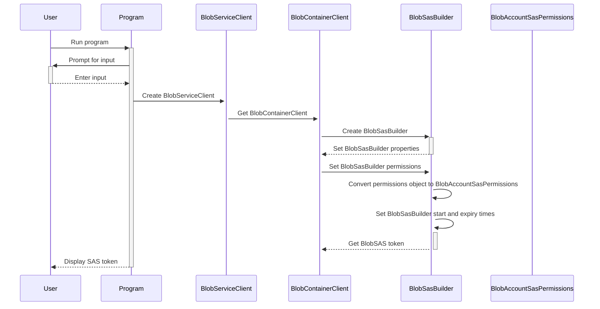
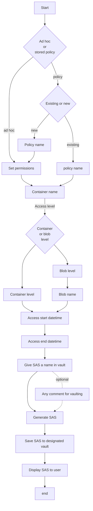

    

# SASKeep v1.0

SASKeep is a .NET 6.0 console application, written in C# 10.0, that generates Shared Access Signature (SAS) tokens for Azure Storage Accounts, and saves them safely in a designated Azure Key Vault. The SAS tokens can be created either at the container or blob level, and can utilize ad-hoc permisions or together with a stored access policy. 

## Diagrams and flows



### Userinput flows



<br />

## Why this app?
This came up in a course I was delivering as "something that would be nice to have" in order to keep some track on this. Azure does not keep track of the SAS generated for various reasons, by design. By storing the information in Azure Key Vault you get the audit and visibility you need on the generated SAS as well as who gains access to the secrets. In that essense you get an edge on the compliance part of things.

### Some details on Shared Access Signatures (SAS)
In simple terms, a shared access signature is a signed URL that grants access to storage resources. This URL contains a token with specific query parameters, which specifies the level of access granted to the client for the resources.

A SAS can be of two forms:
<li>Ad hoc SAS. When you create an ad hoc SAS, the start time, expiry time, and permissions are specified in the SAS URI. Any type of SAS can be an ad hoc SAS.
<li>Service SAS with stored access policy. A stored access policy is a set of constraints defined on a resource container, such as a blob container, table, queue, or file share. These constraints are used to manage one or more service shared access signatures (SAS). By associating a service SAS with a stored access policy, the SAS can inherit the defined constraints, including the start time, expiry time, and permissions. This is the recommended way for creating SAS.


[image courtesy of Microsoft, find the relevant doc at https://learn.microsoft.com/en-us/azure/storage/common/storage-sas-overview]

<br/>

## Usage

The code prompts the user for various inputs, including the Azure Storage account name and access key, the container or blob name, the start and expiry times for the SAS token, and the name of the SAS token to be stored as Secret in the Azure Key Vault. The user can also provide an optional comment to go along with the Secret utilizing its Content Type property. Saving the created SAS token in an Azure Key Vault as a Secret is safe, and easier to safe guard with multiple security controls, compared to other data stores.

The SAS token is generated using the `GetBlobUri()` method, which takes in all the necessary parameters, including the Azure Storage account name and access key, the container or blob name, the start and expiry times for the SAS token, and the permissions to be granted to the SAS token. The method also takes in the Azure AD tenant ID, client ID, and client secret, which are used to authenticate to the Azure Key Vault. Finally, the method takes in the URI of the Key Vault, the name of the SAS token to be stored, and an optional comment for the SAS token in the Key Vault.

The token are generated based on the Storage Account Key that is saved as a Secret, in the designated Azure Key Vault of the solution, and accessed by the Azure AD App Registration service principal. 

<br />

## Project references
<li>Azure.Core
<li>Azure.Identity
<li>Azure.Storage
<li>Azure.Security.KeyVault.Secrets
<li>System.Security.Cryptography

<br />

## Plumbing needed

For the app to operate there are some prerequisities that need to be in place:

<li> Some basic access to Azure AD tenant to create the App Registration. No need to have privileged role, i.e. Global Administrator.
<li> Access to an Azure Subscription with rights to create a Resource Group to hold the Key Vault. In case you have less rights, just make the appropriate changes to the AZ CLI script (az-res.sh) to create only the needed resources, i.e. in case you have already a resource group, then start from the Key Vault creation onwards.
<li> Create the Key Vault. 
<li>Add 3 secrets: `accountConnectionString` to store the connection string of your storage account, `accountKey` to sign the shared access signatures with, and `accountName` the hold the name of your storage account. The application will use the App Registration service principal to access the Azure Key Vault to gain access to these 3 variables in order to generate and sign the SAS tokens.

## Some bits on security

The needed information to interact with the Azure Storage Account and the Azure Key Vault is done through an Azure AD App Registration. The Azure AD Tenant Id, the App Registration (Client) Id, and the Client Secret are saved in encrypted format, using the DPAPI, as environmental variables on the user profile of the execution user context, providing isolation from other users, and reusability without exposing information. Make sure that you are compliant with your organization when using the SASKeep application. 

## How to deploy

You will need access to Azure CLI, best option if you are new to this, the Azure Cloud Shell. You can access it from the Azure Portal (https://portal.azure.com) on the top bar you will see this icon  or better yet, go to https://shell.azure.com.

Once you are in there, choose as shell "Bash".  

. 

You can also do it with PowerShell, but I chose AZCLI.

<br />

You can find the complete script, with comments, in the relevant bash file in this directory <b>[azresh.sh](./azres.sh)</b>

```AZCLI
resourceGroupName="<your resource group name here>"
location="<enter your preferred location>"
keyVaultName="kvSASKeep"
appName="SASKeep"

az group create --name $resourceGroupName --location $location 
az keyvault create --name $keyVaultName --resource-group $resourceGroupName --location $location

clientid=$(az ad app create --display-name $appName --query appId --output tsv)
objectid=$(az ad app show --id $clientid --query id --output tsv)

clientsecretname=mySecret
clientsecretduration=1 
clientsecret=$(az ad app credential reset --id $clientid --append --display-name $clientsecretname --years $clientsecretduration --query password --output tsv)
echo $clientsecret 

az ad sp create --id $clientid
spid=$(az ad sp show --id $clientid --query id --output tsv)

az keyvault set-policy --name $keyVaultName --object-id $spid --secret-permissions get set
```

### Next step
Now that you have the key vault ready, you need to add the 3 secrets that the application needs to generate the SAS for your storage account.
<li>Azure Storage Account Name
<li>Azure Storage Account Connection String
<li>Azure Storage Account Key

<br />

There is also relevant code in the bash file <b>[azresh.sh](./azres.sh)</b> for that or you can use the Azure portal to add them.

```AZCLI bash
az keyvault secret set --vault-name $keyVaultName --name "accountName"  --value "<storage_account_name>"

az keyvault secret set --vault-name $keyVaultName --name "accountConnectionString"  --value "<storage_account_connection_string>"

az keyvault secret set --vault-name $keyVaultName --name "accountKey"  --value "<storage_account_key>"
```
<br />

## Important
Always make sure that you deploy with the "least privilege" principle in mind when it comes to access on your Azure resources, and specifically the Azure key vault that holds all the Secrets.

DO NOT store any sensitive information in configuration files as it can be easily read by other people and/or processes.

<br />

### Something for last
This is just some first thoughts that came to mind and I put them together in this first version. I'm sure that there are many features to be added, and that is why I open it up here so that you can extend it and use it as you want to.

Have fun and enjoy responsibly.
